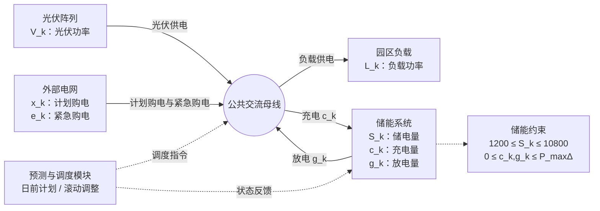

```mermaid
```mermaid
flowchart LR
    PV[光伏阵列<br/>V_k：光伏功率]
    GRID[外部电网<br/>x_k：计划购电<br/>e_k：紧急购电]
    BUS((公共交流母线))
    LOAD[园区负载<br/>L_k：负载功率]
    ESS[储能系统<br/>S_k：储电量<br/>c_k：充电量<br/>g_k：放电量]
    CTRL[预测与调度模块<br/>日前计划 / 滚动调整]

    PV -->|光伏供电| BUS
    GRID -->|计划购电与紧急购电| BUS
    BUS -->|负载供电| LOAD
    BUS -->|充电 c_k| ESS
    ESS -->|放电 g_k| BUS
    CTRL -.->|调度指令| BUS
    CTRL -.->|状态反馈| ESS

    LIM[储能约束<br/>1200 ≤ S_k ≤ 10800<br/>0 ≤ c_k,g_k ≤ P_maxΔ]
    ESS -.-> LIM
```
```